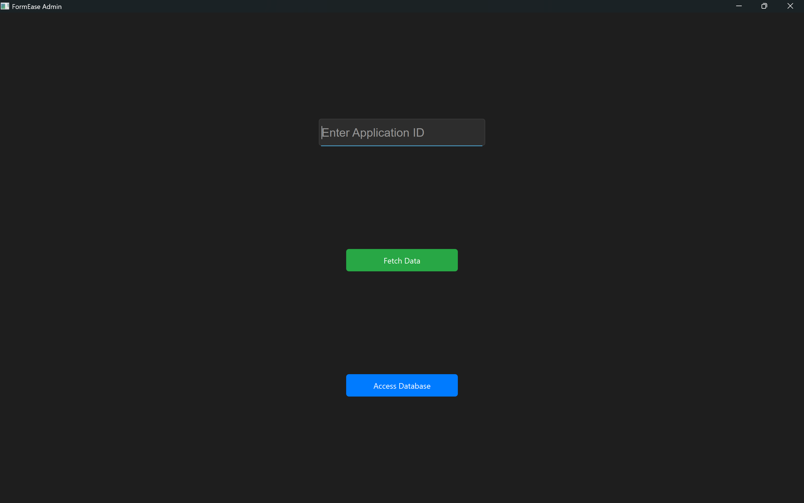
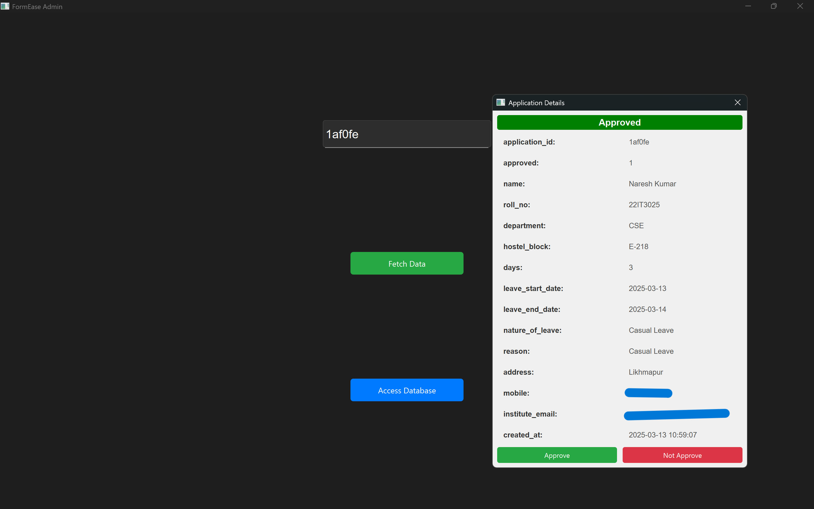
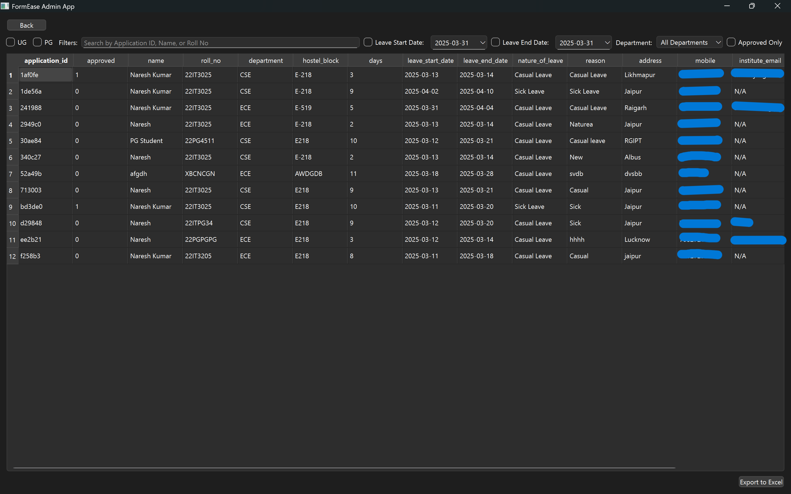

# 🚀 FormEase Admin App

The **FormEase Admin App** is a Python desktop application built using **PyQt** that allows administrators to **manage, review, and approve** leave applications submitted through the **FormEase User App**.

---

## 📋 Features

- 🔍 **Search by Application ID:**  
  - Enter an application ID to retrieve the form details.
  - View all the details in a pop-up window.

- ✅ **Approve/Not Approve Options:**  
  - "Approve" updates the `approved` column in the database to `1`.  
  - "Not Approve" keeps the status unchanged.  

- 📊 **Database Access and Editing:**  
  - View and filter all form data.  
  - Edit form data directly from the admin app.
  - Analyse the trend of Leave.  
  - Export the data to an Excel file.  

---

## 🛠️ Tech Stack

- **Language:** Python  
- **Framework:** PyQt  
- **Database:** MySQL  
- **Version Control:** Git & GitHub  

---

## 💻 Installation Instructions

1. **Clone the Repository**
```bash
git clone https://github.com/naresh6184/FormEase_Admin_App.git
cd FormEase_User_App
```
2. **Install dependencies**
```bash
python -m venv venv
```
3. 💻 Activate the virtual environment:

- On **Windows**:
    ```bash
    venv\Scripts\activate
    ```

- On **Linux/macOS**:
    ```bash
    source venv/bin/activate
    ```

4. 📦 **Install the required dependencies:**
```bash
pip install -r requirements.txt
```

###  Set Up the MySQL Database

Ensure you have **MySQL Server** running.  
Import the database schema if you haven't already:

```sql
CREATE DATABASE leave_management;
USE leave_management;

-- Table for leave applications
CREATE TABLE leave_applications (
    id INT AUTO_INCREMENT PRIMARY KEY,
    application_id VARCHAR(6) NOT NULL UNIQUE,
    name VARCHAR(100),
    roll_no VARCHAR(20),
    department VARCHAR(100),
    hostel_block VARCHAR(100),
    days INT,
    leave_start_date DATE,
    leave_end_date DATE,
    nature_of_leave VARCHAR(100),
    reason TEXT,
    address TEXT,
    mobile VARCHAR(15),
    institute_email VARCHAR(100),
    approved BOOLEAN DEFAULT 0
);
```
Make sure the database credentials in ```server.py``` are properly configured.

### Running the Application
Start the Python admin app by running:
```bash
python main.py
```

## 📚 Usage Instructions

1. **Search by Application ID:**  
    - Enter the application ID in the search bar.  
    - Click the **Fetch** button to view the application details.  

2. **Approve/Not Approve:**  
    - Click the **"Approve"** button to approve the application.  
    - Click the **"Not Approve"** button to keep the status unchanged.  

3. **Access Database:**  
    - Click the **"Access Database"** button to view the full data table.  
    - Apply filters or export data to Excel.  

## App Screenshots

| Home Page |
|-----------|
|  |

| Fetch Application |
|-------------------|
|  |

| Access Database |
|------------------|
||


## 🛡️ Security
---

- Sensitive database credentials are stored in a `.env` file (ignored by Git).  
- Environment variables are loaded using `dotenv` to prevent credential exposure.  

---

## 🛠️ Technologies Used
---

- **PyQt5:** For creating the GUI.  
- **MySQL:** For data storage and management.  
- **Excel Export:** To generate Excel reports from database records.  

## 📌 Contributing
---

If you want to contribute:

1. Fork the repository.  
2. Create a new branch:  
    ```bash
    git checkout -b feature-branch
    ```  
3. Make your changes and commit them.  
4. Push to the branch:  
    ```bash
    git push origin feature-branch
    ```  
5. Create a Pull Request.  

---

## 📄 License
---

This project is licensed under the **MIT License**.

---

## 💬 Author
---

For any queries or issues, feel free to contact:

- **Name:** Naresh Jangir 
- **Email:** nareshjangir6184@gmail.com  
- **GitHub:** [naresh6184](https://github.com/naresh6184)  


